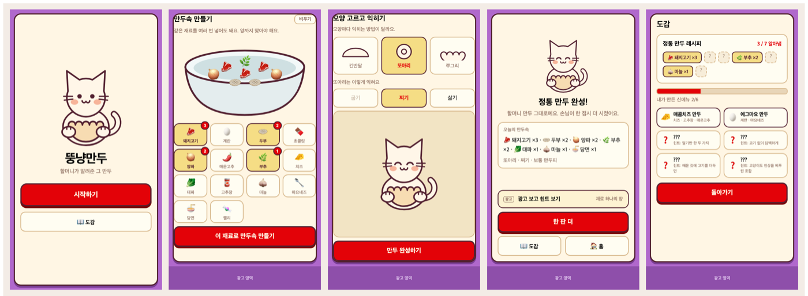

# 뚱냥만두

고양이와 함께 만두를 빚는 토스 미니앱. 정답 레시피는 **단 하나**고, 재료 종류뿐 아니라 **양까지** 맞아야 나옵니다.

토스 앱에서 `뚱냥만두`를 검색하거나 [intoss://mandu-game](intoss://mandu-game)으로 열 수 있습니다.



## 어떤 게임인가

재료 14가지 중 정답 7가지를 골라야 하는데, **종류만 맞아서는 안 되고 양까지 맞아야** 합니다. 같은 재료를 여러 번 넣을 수 있고, 정답은 총 12번의 선택입니다. 하나라도 어긋나면 손님이 그냥 나갑니다.

정답을 모르면 맞힐 수 없기 때문에, 광고를 보면 정답 재료 하나의 양을 알려줍니다. 한 번 알아낸 재료는 계속 남습니다.

**틀렸다고 다 실패는 아닙니다.** 미리 정해둔 조합에 걸리면 고양이가 "오! 신메뉴로 등재"하며 도감에 넣어줍니다. 정통 레시피를 쫓는 재미와 엉뚱한 조합을 찾는 재미가 따로 굴러갑니다.

## 한 판의 흐름

```
만두속  →  반죽  →  모양 + 조리법  →  결과
14종 중       만두피 두께      모양마다 익히는       정통 / 신메뉴 / 실패
중복 선택                      방법이 다름
```

반죽·모양·조리법은 맛에 영향이 없습니다. 완성된 만두의 생김새만 정합니다.

### 판정

| 순서 | 조건 | 결과 |
|---|---|---|
| 1 | 재료 종류와 수량이 모두 일치 | **정통** |
| 2 | 신메뉴 조합과 종류만 일치 (수량 무관) | **신메뉴** — 도감 등록 |
| 3 | 그 외 | **실패** — 몇 가지를 맞췄는지만 알려줌 |

## 로컬 실행

```bash
npm install
cp .env.example .env   # 광고 지면 ID (없어도 실행됩니다)
npm run dev            # http://localhost:5174
```

로컬 브라우저에는 토스 브릿지가 없어서 광고는 동작하지 않고 햅틱은 `navigator.vibrate`로 대체됩니다. 게임 로직은 그대로 테스트할 수 있습니다.

정답을 바로 넣어보려면 `src/game/recipe.ts`의 `RECIPE`를 보세요. (게임에서 직접 찾아보실 거라면 열지 마세요.)

### 스크립트

| 명령 | 설명 |
|---|---|
| `npm run dev` | 로컬 개발 서버 |
| `npm run build` | 타입체크 + 프로덕션 번들 (`dist/`) |
| `npm run ait:build` | 앱인토스 `.ait` 번들 생성 |

`.ait` 번들을 만든 뒤 앱인토스 콘솔에서 업로드합니다.

## 구조

```
src/
├── game/
│   ├── ingredients.ts    재료 14종 (정답 7 + 오답 7)
│   └── recipe.ts         정통 레시피 · 신메뉴 6종 · judge()
├── stages/               만두속 / 반죽 / 모양 — 전부 선택형
├── screens/              Title / Play / Result / Collection
├── components/           만두 든 고양이 캐릭터 (표정 4종) · 재료 그릇
├── ads/                  광고 정책 가드 · 배너 슬롯
└── platform.ts           SafeArea · 익명 유저키
assets/make_icon.py       앱 아이콘 생성 (PIL 없이 zlib PNG 직접 인코딩)
design/                   화면 목업
```

판정 로직은 번들해서 바로 돌려볼 수 있습니다.

```bash
npx esbuild src/game/recipe.ts --bundle --format=esm --outfile=/tmp/recipe.mjs
node --input-type=module -e 'import {judge, RECIPE} from "/tmp/recipe.mjs"; console.log(judge({...RECIPE}))'
```

## 기술

[@apps-in-toss/web-framework](https://developers-apps-in-toss.toss.im) (WebView SDK) · React 19 · Vite · TypeScript

2000년대 초 플래시 게임 느낌의 색을 썼습니다 — 배경 보라 `#B068CC`, 강조 노랑 `#F5DD85`, 빨강 `#E30208`. 고양이와 아이콘은 SVG/코드로 그렸습니다.
